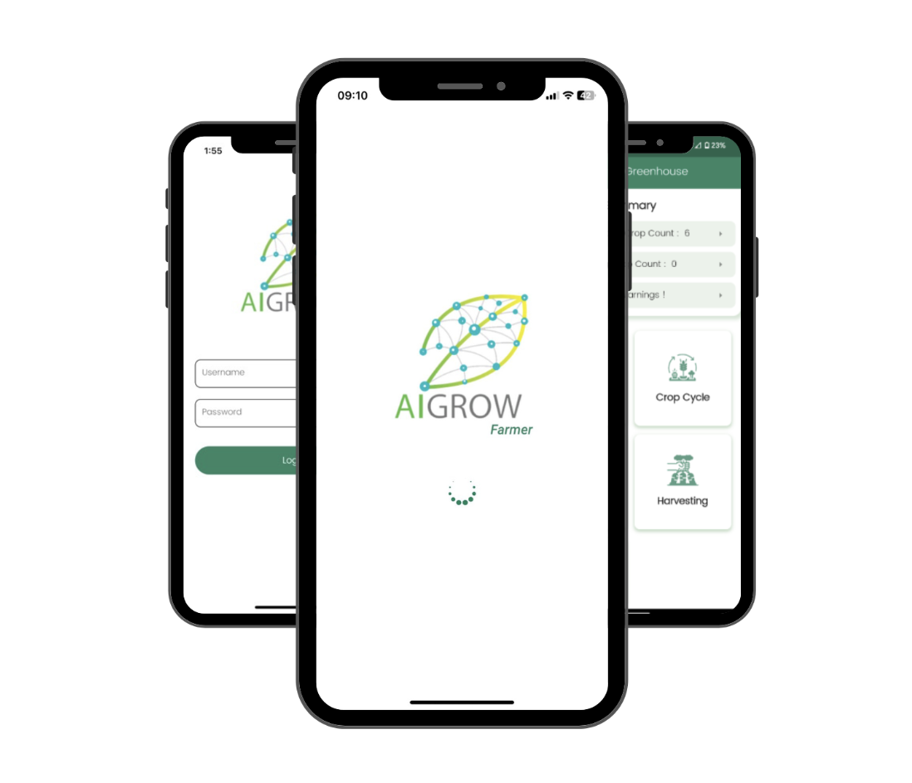
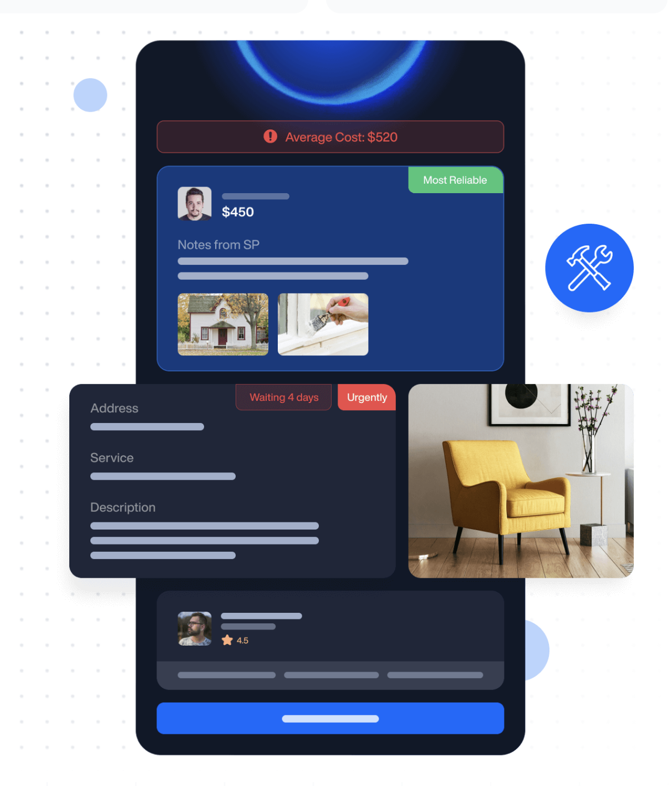
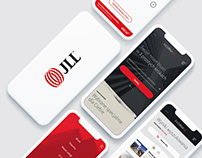

<h1 class="hero-title">GAYASHAN WALAWAGE</h1>

<h2 class="hero-role">Senior UI/UX Engineer | Project Coordinator | MBA Candidate</h2>

Crafting intuitive digital experiences with 5+ years of expertise in UI/UX design and front-end development.

5+

YEARS EXPERIENCE

30+

PROJECTS

3

COUNTRIES

<a href="projects.qmd" class="btn-primary">View My Work</a>
<a href="contact.qmd" class="btn-outline">Get In Touch</a>

---

## Featured Projects

<h3>AI Grow</h3>

Smart agriculture platform with IoT integration for greenhouse monitoring.

<a href="projects.qmd#ai-grow">View Project →</a>

<h3>Bricks+Agent</h3>

AI-powered property management platform connecting tenants and contractors.

<a href="projects.qmd#bricks-agent">View Project →</a>

<h3>Vega EVX</h3>

Electric vehicle platform focused on EV fleet and charging infrastructure.

<a href="projects.qmd#vega-evx">View Project →</a>

<h3>JLL</h3>

AI-powered insuarance platform connecting tenants and contractors.

<a href="projects.qmd#jll">View Project →</a>

